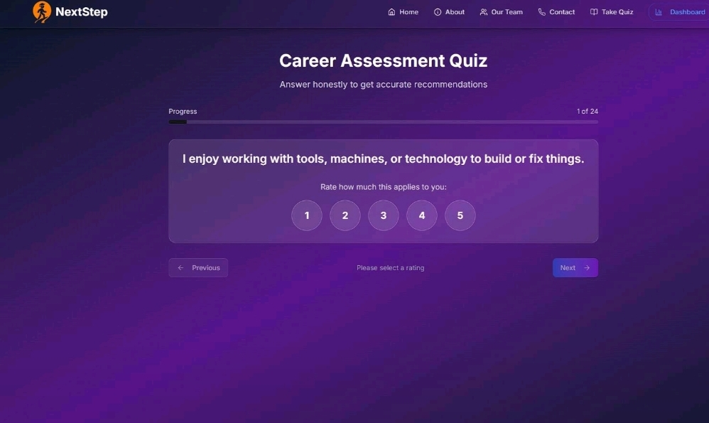
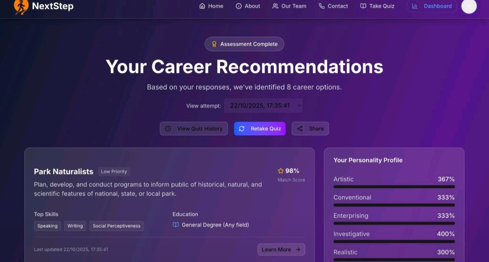
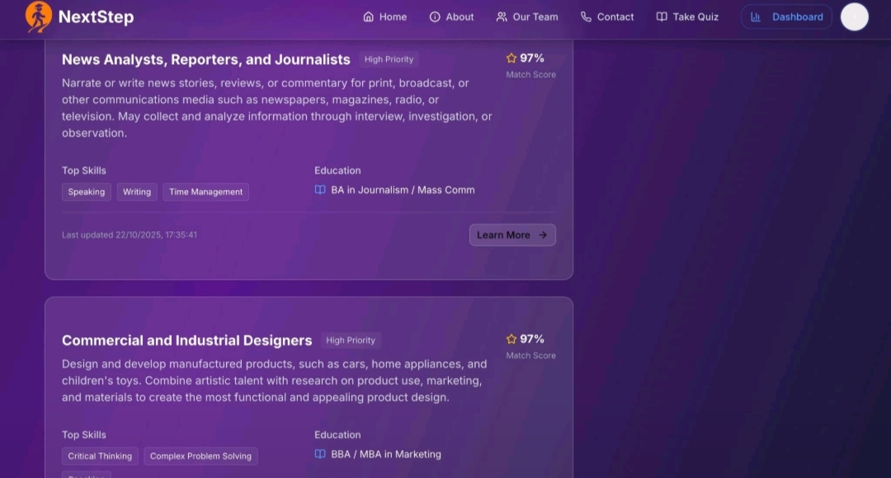

# NextStep Career Recommendation Platform (SIH 2025)

## Overview

NextStep is an AI-powered career recommendation platform designed to help students choose suitable career paths based on their interests, personality traits, and academic preferences.

The platform uses a RIASEC-based psychological assessment and a Machine Learning recommendation engine to generate personalized career recommendations.

---

## Features

- 24-question RIASEC psychological assessment
- Personalized career recommendations
- Degree and educational qualification suggestions
- Entrance exam recommendations
- Required skills for each career
- O*NET dataset integration
- Machine Learning recommendation engine using Cosine Similarity

---

## Tech Stack

- Python
- Pandas
- NumPy
- Scikit-learn
- FastAPI
- HTML
- CSS
- JavaScript

---

## Screenshots

### Home Page

---

### RIASEC Assessment

---

### Recommendation Page

---

### Result Page

---

## Live Website

The project is currently deployed at:

**Website:** https://lnkd.in/gNzxHhdY

---

## Repository Status

🚧 Source code will be uploaded soon.

---

## Team

SIH 2025 Team Project

Machine Learning Engineer:
**Dimple Saxena**

---

## Contact

Email:
dimplesaxenax@gmail.com
